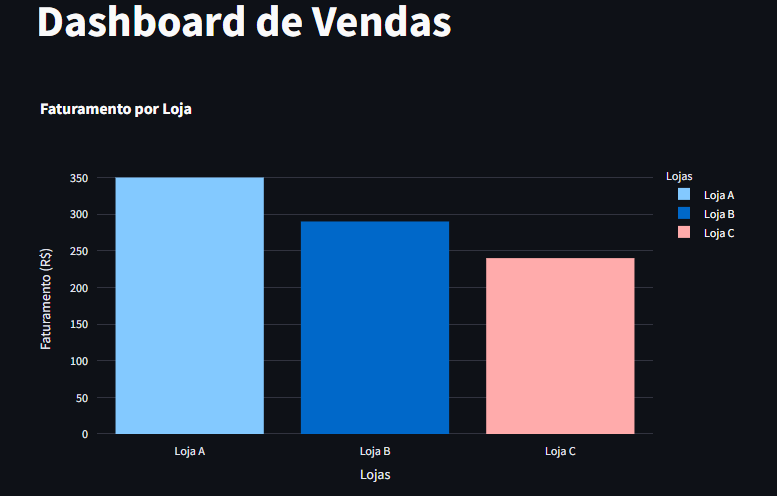

# 📊 Análise de Vendas com Python e Streamlit

Este projeto é um **Dashboard Interativo de Vendas**, desenvolvido com **Python**, 
utilizando as bibliotecas **Pandas**, **Plotly** e **Streamlit**.
O objetivo é visualizar o faturamento por loja de maneira clara, dinâmica e responsiva.

## 🚀 Funcionalidades

- Upload de arquivos CSV personalizados.
- Cálculo automático de faturamento.
- Gráficos interativos de faturamento por loja.
- Filtros dinâmicos para seleção de lojas.
- Visualização dos dados em tabela.

## 📷 Demonstração



## 🛠️ Tecnologias Utilizadas

- Python
- Pandas
- Streamlit
- Plotly

## 📦 Instalação Local

1. Clone o repositório:

```bash
git clone https://github.com/Tatianakami/Analise-de-vendas-Python.git
cd Analise-de-vendas-Python
